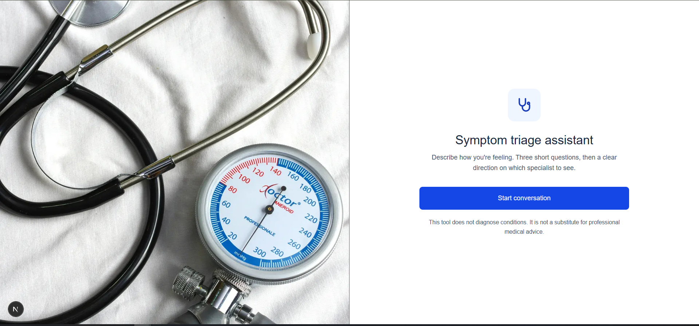
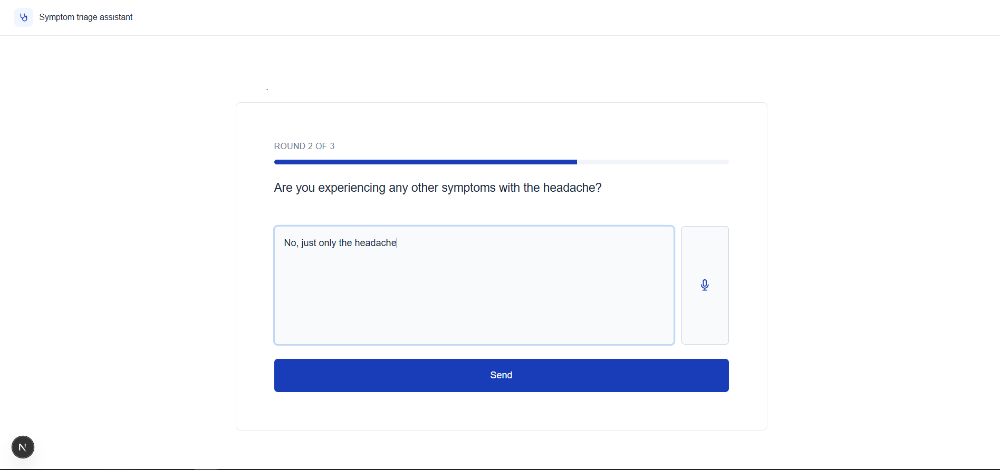
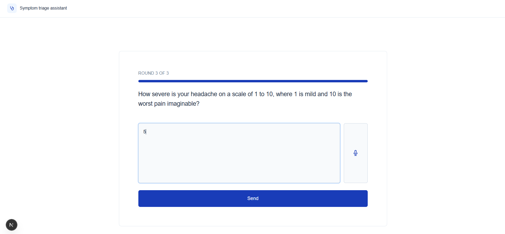
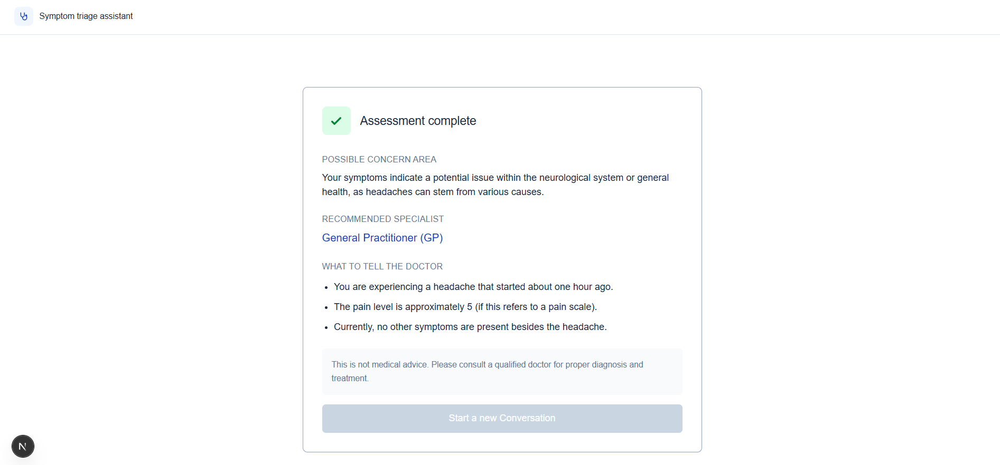
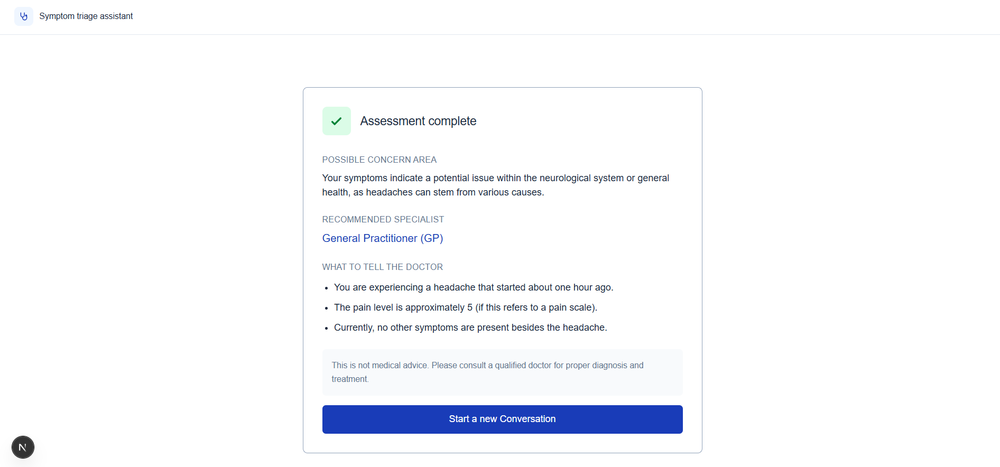
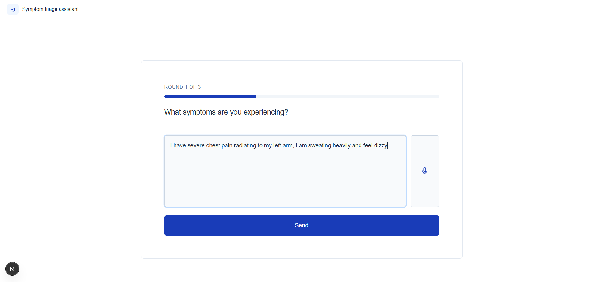
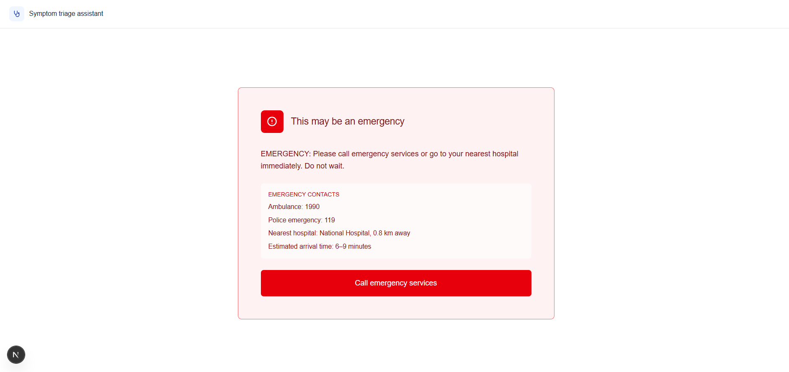

# Health AI Consultant

An AI-powered symptom triage assistant that guides users through a structured three-round conversation, then delivers a clear specialist recommendation with voice output. Built as a portfolio project to demonstrate production-level AI integration, full-stack engineering, and safety-first design thinking.

> **Not a medical device.** This project is a technical portfolio demonstration. It does not provide medical advice or replace professional consultation.

---

## What It Does

A user describes their symptoms, either by typing or speaking. The system asks two targeted follow-up questions, then delivers a structured triage recommendation: which type of specialist to see and exactly what to tell them. The final result is read aloud via a local text-to-speech model with a staged loading experience.

If the user describes a genuine emergency at any point in the conversation, such as chest pain with arm numbness or signs of stroke, the system detects this immediately on that same round and presents an emergency response with direct call-to-action links, without waiting until round 3.

---

## Screenshots

### 1. Landing Page
Clean split layout with medical imagery on the left and a focused call-to-action on the right. Responsive on mobile with a frosted-glass card over a faded background image.



---

### 2. Chat — Round 1 of 3
Session starts automatically on page load, no extra button click needed. Progress bar at one third. User can type or tap the microphone to speak their answer.


---

### 3. Chat — Round 2 of 3
Gemini asks a targeted follow-up question based on the initial symptoms. Progress bar advances to two thirds.



---

### 4. Chat — Round 3 of 3
Final clarifying question before triage result is generated. Progress bar at full.



---

### 5. Loading Screen — Voice Result Being Prepared
While Kokoro generates the spoken audio, a staged three-step checklist keeps the user informed. A traveling dot animation provides ambient motion. Text result is hidden until audio is ready.


---

### 6. Result — Normal Triage (Audio Playing)
Structured result card with labeled sections: possible concern area, recommended specialist highlighted in blue, bullet points for the doctor conversation, and a soft disclaimer box. The "Start a new Conversation" button is disabled while voice is still playing.



---

### 7. Result — Normal Triage (Audio Complete)
Once spoken playback finishes, the navigation button becomes active and the user can start a new consultation.



---

### 8. Emergency Flow — Symptom Input (Round 1)
Classic heart attack warning signs entered at round 1. The system detects this immediately on the same round without waiting for further questions, demonstrating the safety-critical emergency detection fix.



---

### 9. Result — Emergency Detected
When emergency symptoms are described, the system responds immediately with a distinct red card. Contact numbers and estimated arrival times are displayed. The "Call emergency services" button expands to show specific service options.



---

## Tech Stack

| Layer | Technology | Why |
|---|---|---|
| Backend framework | FastAPI (Python) | Async-first, automatic OpenAPI docs, clean dependency injection |
| AI reasoning | Google Gemini 2.5 Flash | Best free-tier quality for structured prompt output; migrated from deprecated `google-generativeai` to new `google-genai` SDK |
| Voice input | OpenAI Whisper (local) | Runs entirely on CPU, no API cost, genuinely good accuracy on medical terminology |
| Voice output | Kokoro TTS 0.9.4 (local) | 82M parameter model, MIT licensed, natural-sounding output without cloud dependency |
| Frontend | Next.js 15 + Tailwind CSS | App Router, TypeScript, fully responsive design |
| Audio processing | ffmpeg | Required by Whisper for audio format decoding |
| Phoneme engine | eSpeak-NG | Required by Kokoro for text-to-phoneme conversion |
| Testing | pytest + FastAPI TestClient | Unit and integration tests covering all critical paths |
| Version control | GitHub | Full commit history from initial project structure to final polish |

---

## Architecture

```
Browser
  │
  ├─ GET  /          → Next.js landing page
  ├─ GET  /chat      → Next.js chat page (auto-starts session on load)
  │
  └─ API calls to FastAPI backend
       │
       ├─ POST /api/chat/start       → Creates session (UUID, in-memory store)
       ├─ POST /api/chat/message     → Sends message, calls Gemini, returns response
       ├─ POST /api/voice/transcribe → Receives audio blob, runs Whisper, returns text
       └─ POST /api/voice/speak      → Receives text, runs Kokoro, returns WAV bytes
```

**Session flow:**
```
Round 1 → Gemini checks for emergency, then asks follow-up question
Round 2 → Gemini checks for emergency, then asks follow-up question
Round 3 → Gemini checks for emergency, then returns structured triage result
             OR
Any round → EMERGENCY detected → session terminates, emergency card shown immediately
```

---

## Key Engineering Decisions

### Emergency Detection on Every Round

The initial design only checked for emergency symptoms at the final round. During testing with real emergency-level input ("I have crushing chest pain and my left arm feels numb"), the system asked two casual follow-up questions before flagging the emergency, a genuine safety gap that could cost critical minutes in a real situation.

The fix restructured the prompt architecture so every round prepends the emergency check before any other instruction. The backend's `chat.py` then checks whether the response starts with `"EMERGENCY"` regardless of which round triggered it, and terminates the session immediately.

A dedicated regression test now permanently encodes this behavior:

```python
def test_emergency_detected_on_round_1():
    """
    Critical safety test: emergency symptoms should trigger
    is_emergency=True immediately on round 1, not wait until round 3.
    This was a real bug found and fixed during development.
    """
```

### Voice Architecture: Per-Message, Not Session-Locked

Early design considered locking the entire session into text mode or voice mode at the start. This was rejected for two reasons: it removed mid-conversation flexibility, and it added unnecessary state complexity.

Instead, voice output triggers only for the final result. This keeps follow-up exchanges fast and text-only, while delivering the most important information, the triage result, as spoken audio with a staged loading experience.

### Kokoro Audio Chunking Fix

The initial Kokoro integration only captured the first audio chunk from the generator and discarded the rest. For short follow-up questions this was invisible, but the final multi-line result was being spoken as a single sentence only.

Fix: collect all chunks into a list, then concatenate via `np.concatenate` before writing a single WAV buffer, producing complete, continuous speech for the full result.

### Navigation Guard During Playback

Both the "Start a new Conversation" button and the shared `Header` component's logo link are disabled while audio is actively playing, preventing the user from navigating away mid-speech. The `Header` component accepts an optional `disableNavigation` prop that conditionally renders a non-clickable version of its content:

```tsx
{disableNavigation ? content : <Link href="/">{content}</Link>}
```

### Image Optimization

The stethoscope photo was converted from a 4.7MB JPEG at 4000x6016px to a 364KB WebP at 1200x1804px, a 92% file size reduction with no visible quality loss, achieved via Pillow's Lanczos resampling.

### Gemini SDK Migration

Discovered during initial testing that `google-generativeai` was fully deprecated. Migrated to the new `google-genai` client-based pattern before building further on top of it. The old module-level configuration approach was replaced with an explicit client object that supports multiple independent connections.

### Free Tier Quota Management

Gemini's free tier enforces a daily request limit. A `USE_DUMMY_RESPONSES` toggle in `gemini_service.py` was added early to allow full frontend and voice development without burning quota. This pattern, explicit toggles with loud comments rather than environment detection, made quota-sensitive development practical throughout the build.

---

## Running Locally

### Prerequisites

- Python 3.11+
- Node.js 18+
- ffmpeg (for Whisper audio decoding)
- eSpeak-NG (for Kokoro phoneme conversion)

**Install ffmpeg (Windows):**
```bash
winget install Gyan.FFmpeg
```

**Install eSpeak-NG (Windows):**
```bash
winget install eSpeak-NG.eSpeak-NG
```

### Backend

```bash
cd backend
python -m venv venv
venv\Scripts\activate        # Windows
pip install -r requirements.txt

# Create .env file
echo GEMINI_API_KEY=your_key_here > .env

# Run
uvicorn main:app --reload
```

Backend runs at `http://localhost:8000`. Interactive API docs at `http://localhost:8000/docs`.

### Frontend

```bash
cd frontend
npm install

# Create .env.local file
echo NEXT_PUBLIC_API_URL=http://127.0.0.1:8000 > .env.local

# Run
npm run dev
```

Frontend runs at `http://localhost:3000`.

### Tests

```bash
cd backend
pytest tests/ -v
```

All 7 tests pass, including the emergency detection regression test.

---

## Test Coverage

| Test | What It Validates |
|---|---|
| `test_start_chat_creates_session` | Session creation returns a valid UUID |
| `test_message_requires_valid_session` | Fake session IDs are rejected with 404 |
| `test_normal_three_round_flow` | Happy path completes in exactly three rounds |
| `test_emergency_detected_on_round_1` | Emergency triggers immediately, not at round 3 |
| `test_emergency_ends_session` | Session is terminated after emergency detection |
| `test_non_emergency_does_not_trigger_emergency_flag` | Safe symptoms never produce false positives |
| `test_health_check` | Backend health endpoint responds correctly |

---

## Project Structure

```
health-ai-consultant/
├── backend/
│   ├── main.py                  # FastAPI app, CORS, router includes
│   ├── models/
│   │   └── schemas.py           # Pydantic request/response models
│   ├── routers/
│   │   ├── chat.py              # Chat endpoints, round logic, emergency detection
│   │   └── voice.py             # Transcription and speech endpoints
│   ├── services/
│   │   ├── gemini_service.py    # Gemini API client, USE_DUMMY_RESPONSES toggle
│   │   ├── whisper_service.py   # Whisper transcription
│   │   ├── kokoro_service.py    # Kokoro TTS, audio chunk concatenation fix
│   │   └── session_service.py   # In-memory session store with timeout
│   ├── prompts/
│   │   └── triage_prompt.py     # All prompt templates, emergency check on every round
│   └── tests/
│       └── test_critical.py     # 7 tests covering all critical paths
└── frontend/
    ├── src/
    │   ├── app/
    │   │   ├── page.tsx         # Landing page, split layout, mobile responsive
    │   │   └── chat/
    │   │       └── page.tsx     # Full chat flow, all screens, voice I/O
    │   ├── components/
    │   │   └── Header.tsx       # Shared header with disableNavigation prop
    │   └── lib/
    │       └── api.ts           # All backend API calls, typed with interfaces
    └── public/
        └── stethoscope.webp     # Optimized from 4.7MB JPG to 364KB WebP
```

---

## What I Would Add With More Time

- Persistent session storage (Redis or DynamoDB) to replace the current in-memory store
- Real location detection to show accurate emergency numbers per country rather than placeholders
- Whisper model upgrade from "base" to "small" for better transcription accuracy on medical terminology
- Render/Vercel deployment with Kokoro timing constants re-measured on cloud CPU
- Rate limiting on the chat endpoint to prevent quota exhaustion in shared demos
- Streaming Gemini responses for faster perceived response time on slower connections

---

Built by [Kavindu Edirimanne](https://github.com/KavinduDev) — Full Stack Engineer
